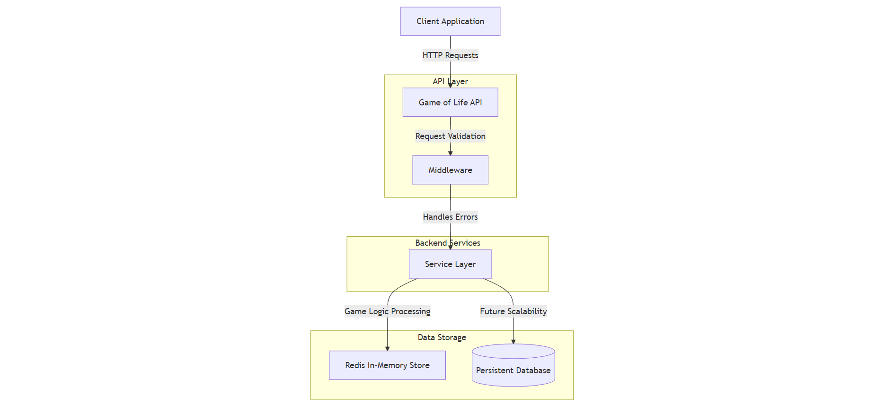

# Conway's Game of Life API

## Problem Description
Conway's Game of Life is a cellular automaton devised by mathematician John Conway. It consists of a grid of cells, where each cell can be in one of two states: **alive** (`true`) or **dead** (`false`). The state of the grid evolves over discrete time steps according to the following rules:

1. Any live cell with fewer than two live neighbors dies (underpopulation).
2. Any live cell with two or three live neighbors lives on to the next generation.
3. Any live cell with more than three live neighbors dies (overpopulation).
4. Any dead cell with exactly three live neighbors becomes a live cell (reproduction).

This API provides functionalities to:
- Upload an initial board state.
- Retrieve the next state of the board.
- Retrieve the board state after a specified number of steps.
- Retrieve the final state of the board, detecting cycles or stabilization.

---

## System Architecture

### Current Architecture
The current architecture is a monolithic design, as shown below:


### Future Architecture
The future architecture is based on clean architecture principles with microservices for modularity and scalability:
.png)

---

## API Endpoints

### Upload a New Board
**POST** `/api/gameoflife/upload`

Uploads a new board and returns a unique ID for it.

**Request Body:**
```json
{
  "rows": 3,
  "columns": 3,
  "state": [[true, false, false], [false, true, false], [false, false, true]]
}
```
## Response:
```json
{
  {
    "id": "<GUID>"
  }
}
```
___

